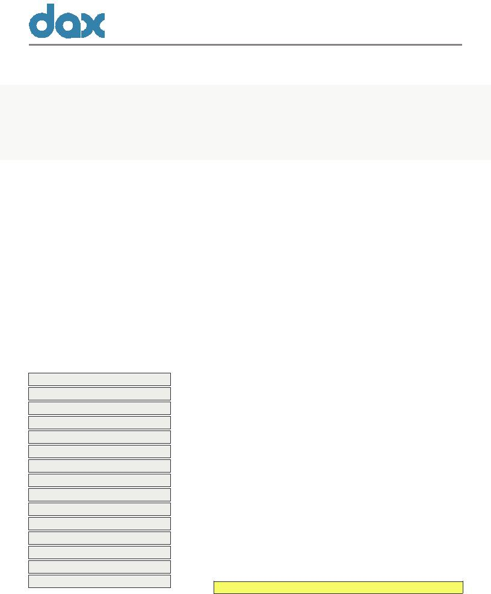

<!DOCTYPE HTML PUBLIC "-//W3C//DTD HTML 4.01//EN" "http://www.w3.org/TR/html4/strict.dtd">
```html
<HTML>
<HEAD>
<META http-equiv="Content-Type" content="text/html; charset=UTF-8">
<META http-equiv="X-UA-Compatible" content="IE=8">
<TITLE>Created by BCL easyConverter SDK 3 (HTML Version)</TITLE>
<STYLE type="text/css">
body {margin-top: 0px;margin-left: 0px;}
#page_1 {position:relative; overflow: hidden;margin: 19px 0px 49px 0px;padding: 0px;border: none;width: 816px;height: 988px;}
#page_1 #id_1 {border:none;margin: 71px 0px 0px 48px;padding: 0px;border:none;width: 768px;overflow: hidden;}
#page_1 #id_2 {border:none;margin: 10px 0px 0px 47px;padding: 0px;border:none;width: 769px;overflow: hidden;}
#page_1 #id_2 #id_2_1 {float:left;border:none;margin: 0px 0px 0px 0px;padding: 0px;border:none;width: 306px;overflow: hidden;}
#page_1 #id_2 #id_2_2 {float:left;border:none;margin: 5px 0px 0px 0px;padding: 0px;border:none;width: 463px;overflow: hidden;}
#page_1 #id_3 {border:none;margin: 0px 0px 0px 0px;padding: 0px;border:none;width: 816px;overflow: hidden;}
#page_1 #dimg1 {position:absolute;top:0px;left:0px;z-index:-1;width:816px;height:988px;}
#page_1 #dimg1 #img1 {width:816px;height:988px;}
.dclr {clear:both;float:none;height:1px;margin:0px;padding:0px;overflow:hidden;}
.ft0{font: bold 23px 'Segoe UI';line-height: 30px;}
.ft1{font: 23px 'Segoe UI';line-height: 31px;}
.ft2{font: bold 21px 'Segoe UI';color: #001c66;line-height: 29px;}
.ft3{font: 12px 'Segoe UI';line-height: 14px;}
.ft4{font: bold 21px 'Segoe UI';color: #001c66;line-height: 30px;}
.ft5{font: bold 12px 'Segoe UI';line-height: 15px;}
.ft6{font: 1px 'Segoe UI';line-height: 9px;}
.ft7{font: 12px 'Segoe UI';line-height: 15px;}
.ft8{font: 12px 'Segoe UI';line-height: 13px;}
.ft9{font: 1px 'Segoe UI';line-height: 14px;}
.ft10{font: 1px 'Segoe UI';line-height: 13px;}
.ft11{font: 1px 'Segoe UI';line-height: 1px;}
.ft12{font: 1px 'Segoe UI';line-height: 5px;}
.ft13{font: 1px 'Segoe UI';line-height: 7px;}
.ft14{font: 10px 'Segoe UI';line-height: 12px;}
.ft15{font: 12px 'Segoe UI';margin-left: 4px;line-height: 14px;}
.ft16{font: 12px 'Segoe UI';margin-left: 4px;line-height: 13px;}
.ft17{font: 12px 'Segoe UI';margin-left: 4px;line-height: 15px;}
.ft18{font: 13px 'Segoe UI';line-height: 17px;}
.ft19{font: italic 15px 'Cambria';color: #4568ad;line-height: 17px;}
.ft20{font: 1px 'Segoe UI';line-height: 2px;}
.ft21{font: 1px 'Segoe UI';line-height: 3px;}
.ft22{font: 1px 'Segoe UI';line-height: 6px;}
.ft23{font: 11px 'Segoe UI';line-height: 13px;}
.ft24{font: 13px 'Segoe UI';line-height: 16px;}
.ft25{font: bold 13px 'Segoe UI';color: #000078;line-height: 17px;}
.p0{text-align: left;margin-top: 0px;margin-bottom: 0px;}
.p1{text-align: left;margin-top: 1px;margin-bottom: 0px;}
.p2{text-align: left;margin-top: 10px;margin-bottom: 0px;}
.p3{text-align: left;padding-right: 49px;margin-top: 0px;margin-bottom: 0px;}
.p4{text-align: left;padding-left: 10px;margin-top: 0px;margin-bottom: 0px;white-space: nowrap;}
.p5{text-align: left;padding-left: 5px;margin-top: 0px;margin-bottom: 0px;white-space: nowrap;}
.p6{text-align: left;margin-top: 0px;margin-bottom: 0px;white-space: nowrap;}
.p7{text-align: left;padding-left: 1px;margin-top: 5px;margin-bottom: 0px;}
.p8{text-align: justify;padding-left: 1px;margin-top: 0px;margin-bottom: 0px;}
.p9{text-align: left;padding-left: 1px;margin-top: 11px;margin-bottom: 0px;}
.p10{text-align: left;padding-left: 63px;margin-top: 1px;margin-bottom: 0px;}
.p11{text-align: left;padding-left: 68px;margin-top: 7px;margin-bottom: 0px;}
.p12{text-align: left;padding-left: 35px;margin-top: 7px;margin-bottom: 0px;}
.p13{text-align: left;padding-left: 51px;margin-top: 7px;margin-bottom: 0px;}
.p14{text-align: left;padding-left: 54px;margin-top: 7px;margin-bottom: 0px;}
.p15{text-align: left;padding-left: 87px;margin-top: 7px;margin-bottom: 0px;}
.p16{text-align: left;padding-left: 73px;margin-top: 7px;margin-bottom: 0px;}
.p17{text-align: left;padding-left: 84px;margin-top: 7px;margin-bottom: 0px;}
.p18{text-align: left;padding-left: 41px;margin-top: 7px;margin-bottom: 0px;}
.p19{text-align: left;padding-left: 86px;margin-top: 7px;margin-bottom: 0px;}
.p20{text-align: left;padding-left: 94px;margin-top: 7px;margin-bottom: 0px;}
.p21{text-align: left;padding-left: 82px;margin-top: 7px;margin-bottom: 0px;}
.p22{text-align: left;padding-left: 18px;margin-top: 7px;margin-bottom: 0px;}
.p23{text-align: left;padding-left: 42px;margin-top: 7px;margin-bottom: 0px;}
.p24{text-align: left;padding-left: 3px;margin-top: 0px;margin-bottom: 0px;}
.p25{text-align: left;padding-left: 4px;margin-top: 0px;margin-bottom: 0px;white-space: nowrap;}
.p26{text-align: right;padding-right: 279px;margin-top: 0px;margin-bottom: 0px;white-space: nowrap;}
.p27{text-align: right;padding-right: 5px;margin-top: 0px;margin-bottom: 0px;white-space: nowrap;}
.p28{text-align: left;padding-left: 3px;margin-top: 6px;margin-bottom: 0px;}
.p29{text-align: right;padding-right: 273px;margin-top: 0px;margin-bottom: 0px;white-space: nowrap;}
.p30{text-align: left;padding-left: 39px;margin-top: 0px;margin-bottom: 0px;white-space: nowrap;}
.p31{text-align: left;padding-left: 1px;margin-top: 0px;margin-bottom: 0px;white-space: nowrap;}
.p32{text-align: left;padding-left: 3px;margin-top: 0px;margin-bottom: 0px;white-space: nowrap;}
.p33{text-align: left;padding-left: 146px;margin-top: 0px;margin-bottom: 0px;}
.p34{text-align: right;padding-right: 167px;margin-top: 0px;margin-bottom: 0px;}
.td0{border-left: #2e2b33 1px solid;border-right: #2e2b33 1px solid;border-top: #2e2b33 1px solid;padding: 0px;margin: 0px;width: 95px;vertical-align: bottom;background: #ededea;}
.td1{border-right: #2e2b33 1px solid;border-top: #2e2b33 1px solid;padding: 0px;margin: 0px;width: 183px;vertical-align: bottom;background: #ededea;}
.td2{border-left: #2e2b33 1px solid;border-right: #2e2b33 1px solid;border-bottom: #000000 1px solid;padding: 0px;margin: 0px;width: 95px;vertical-align: bottom;background: #ededea;}
.td3{border-right: #2e2b33 1px solid;border-bottom: #000000 1px solid;padding: 0px;margin: 0px;width: 183px;vertical-align: bottom;background: #ededea;}
.td4{border-left: #2e2b33 1px solid;border-right: #2e2b33 1px solid;padding: 0px;margin: 0px;width: 95px;vertical-align: bottom;background: #ededea;}
.td5{border-right: #2e2b33 1px solid;padding: 0px;margin: 0px;width: 183px;vertical-align: bottom;background: #ededea;}
.td6{border-left: #2e2b33 1px solid;border-right: #2e2b33 1px solid;border-bottom: #2e2b33 1px solid;padding: 0px;margin: 0px;width: 95px;vertical-align: bottom;background: #ededea;}
.td7{border-right: #2e2b33 1px solid;border-bottom: #2e2b33 1px solid;padding: 0px;margin: 0px;width: 183px;vertical-align: bottom;background: #ededea;}
.td8{border-left: #2e2b33 1px solid;border-right: #2e2b33 1px solid;border-top: #000000 1px solid;padding: 0px;margin: 0px;width: 121px;vertical-align: bottom;}
.td9{border-right: #2e2b33 1px solid;border-top: #000000 1px solid;padding: 0px;margin: 0px;width: 289px;vertical-align: bottom;}
.td10{border-left: #2e2b33 1px solid;border-right: #2e2b33 1px solid;border-top: #000000 1px solid;border-bottom: #000000 1px solid;padding: 0px;margin: 0px;width: 121px;vertical-align: bottom;}
.td11{border-right: #2e2b33 1px solid;border-top: #000000 1px solid;border-bottom: #000000 1px solid;padding: 0px;margin: 0px;width: 289px;vertical-align: bottom;}
.td12{border-left: #2e2b33 1px solid;border-right: #2e2b33 1px solid;padding: 0px;margin: 0px;width: 121px;vertical-align: bottom;}
.td13{border-right: #2e2b33 1px solid;padding: 0px;margin: 0px;width: 289px;vertical-align: bottom;}
.td14{border-left: #2e2b33 1px solid;border-right: #2e2b33 1px solid;border-bottom: #000000 1px solid;padding: 0px;margin: 0px;width: 121px;vertical-align: bottom;}
.td15{border-right: #2e2b33 1px solid;border-bottom: #000000 1px solid;padding: 0px;margin: 0px;width: 289px;vertical-align: bottom;}
.td16{border-top: #000000 1px solid;padding: 0px;margin: 0px;width: 413px;vertical-align: bottom;}
.td17{padding: 0px;margin: 0px;width: 123px;vertical-align: bottom;}
.td18{padding: 0px;margin: 0px;width: 290px;vertical-align: bottom;}
.td19{border-top: #000000 1px solid;padding: 0px;margin: 0px;width: 123px;vertical-align: bottom;}
.td20{border-top: #000000 1px solid;padding: 0px;margin: 0px;width: 290px;vertical-align: bottom;}
.td21{border-bottom: #000000 1px solid;padding: 0px;margin: 0px;width: 123px;vertical-align: bottom;}
.td22{border-bottom: #000000 1px solid;padding: 0px;margin: 0px;width: 290px;vertical-align: bottom;}
.tr0{height: 18px;}
.tr1{height: 9px;}
.tr2{height: 16px;}
.tr3{height: 13px;}
.tr4{height: 14px;}
.tr5{height: 15px;}
.tr6{height: 5px;}
.tr7{height: 19px;}
.tr8{height: 7px;}
.tr9{height: 17px;}
.tr10{height: 2px;}
.tr11{height: 3px;}
.tr12{height: 6px;}
.tr13{height: 24px;}
.tr14{height: 29px;}
.t0{width: 280px;margin-top: 3px;font: 12px 'Segoe UI';}
.t1{width: 412px;margin-left: 2px;margin-top: 7px;font: 12px 'Segoe UI';}
.t2{width: 413px;margin-left: 2px;margin-top: 4px;font: 12px 'Segoe UI';}
</STYLE>
</HEAD>

<BODY>
<DIV id="page_1">
<DIV id="dimg1">

</DIV>


<DIV class="dclr"></DIV>
<DIV id="id_1">
<P class="p0 ft0">String Project</P>
<P class="p1 ft1">- for ETC Production in the Cloud</P>
<P class="p2 ft2">Summary</P>
<P class="p3 ft3">The Entertainment Technology Center (ETC) at the University of Southern California is driving a new initiative, Production in the Cloud, a project involving media and <NOBR>cloud-resource</NOBR> leaders. The project seeks to create guidelines and develop a standard for the next generation of <NOBR>cloud-based</NOBR> content creation, production, and distribution. The goal of the project is to improve the life cycle of film and media production. Executives from major production studios in coordination with Rackspace, EMC, EVault, Front Porch Digital, DAX, Google and other cloud companies serve to guide the initiative. String Project is a component of the larger Production in the Cloud project. String Project is driven by contributors from DAX.</P>
</DIV>
<DIV id="id_2">
<DIV id="id_2_1">
<P class="p0 ft4">Key</P>
<TABLE cellpadding=0 cellspacing=0 class="t0">
<TR>
	<TD class="tr0 td0"><P class="p4 ft5">item</P></TD>
	<TD class="tr0 td1"><P class="p5 ft5">function</P></TD>
</TR>
<TR>
	<TD class="tr1 td2"><P class="p6 ft6">&nbsp;</P></TD>
	<TD class="tr1 td3"><P class="p6 ft6">&nbsp;</P></TD>
</TR>
<TR>
	<TD class="tr2 td4"><P class="p4 ft7">String metadata</P></TD>
	<TD class="tr2 td5"><P class="p5 ft7">register service against asset ID,</P></TD>
</TR>
<TR>
	<TD class="tr3 td4"><P class="p4 ft8">API</P></TD>
	<TD class="tr3 td5"><P class="p5 ft8">register metadata (?), register</P></TD>
</TR>
<TR>
	<TD class="tr4 td4"><P class="p6 ft9">&nbsp;</P></TD>
	<TD class="tr4 td5"><P class="p5 ft3">user/service provider (for now,</P></TD>
</TR>
<TR>
	<TD class="tr3 td4"><P class="p6 ft10">&nbsp;</P></TD>
	<TD class="tr3 td5"><P class="p5 ft8">use keystone later), register</P></TD>
</TR>
<TR>
	<TD class="tr3 td4"><P class="p6 ft10">&nbsp;</P></TD>
	<TD class="tr3 td5"><P class="p5 ft8">service, auth, lookup asset ID,</P></TD>
</TR>
<TR>
	<TD class="tr4 td4"><P class="p6 ft9">&nbsp;</P></TD>
	<TD class="tr4 td5"><P class="p5 ft3">add parent/peer Spring service,</P></TD>
</TR>
<TR>
	<TD class="tr5 td4"><P class="p6 ft11">&nbsp;</P></TD>
	<TD class="tr5 td5"><P class="p5 ft7">configure synchronization set</P></TD>
</TR>
<TR>
	<TD class="tr6 td6"><P class="p6 ft12">&nbsp;</P></TD>
	<TD class="tr6 td7"><P class="p6 ft12">&nbsp;</P></TD>
</TR>
<TR>
	<TD class="tr7 td4"><P class="p4 ft7">String metadata</P></TD>
	<TD class="tr7 td5"><P class="p5 ft7">an application capable of</P></TD>
</TR>
<TR>
	<TD class="tr3 td4"><P class="p4 ft8">API client</P></TD>
	<TD class="tr3 td5"><P class="p5 ft8">processing information from the</P></TD>
</TR>
<TR>
	<TD class="tr2 td4"><P class="p6 ft11">&nbsp;</P></TD>
	<TD class="tr2 td5"><P class="p5 ft7">String API</P></TD>
</TR>
<TR>
	<TD class="tr8 td6"><P class="p6 ft13">&nbsp;</P></TD>
	<TD class="tr8 td7"><P class="p6 ft13">&nbsp;</P></TD>
</TR>
</TABLE>
<P class="p7 ft2">Activities</P>
<P class="p8 ft3"><SPAN class="ft14">1.</SPAN><SPAN class="ft15">document IO API</SPAN></P>
<P class="p8 ft3"><SPAN class="ft14">2.</SPAN><SPAN class="ft15">document String REST API</SPAN></P>
<P class="p8 ft8"><SPAN class="ft14">3.</SPAN><SPAN class="ft16">build String client</SPAN></P>
<P class="p8 ft7"><SPAN class="ft14">4.</SPAN><SPAN class="ft17">build String daemons</SPAN></P>
<P class="p9 ft4">API Elements</P>
<P class="p10 ft18">Login/Identify User</P>
<P class="p11 ft18">Change Password</P>
<P class="p12 ft18">Register AssetID with Service</P>
<P class="p13 ft18">Update AssetID Service</P>
<P class="p14 ft18">Delete AssetID Service</P>
<P class="p15 ft18">Register Us</P>
<P class="p16 ft18">Register Service</P>
<P class="p17 ft18">Query Regis</P>
<P class="p18 ft18">GetAllServicesByAssetHash</P>
<P class="p19 ft18">GetServices</P>
<P class="p20 ft18">GetAsset</P>
<P class="p21 ft18">UpdateAsset</P>
<P class="p22 ft18">Add Parent/Peer Registry (Phase 2)</P>
<P class="p23 ft18">Configure Synchronization</P>
</DIV>
<DIV id="id_2_2">
<P class="p0 ft4">Data Model Elements</P>
<P class="p24 ft19">Users</P>
<TABLE cellpadding=0 cellspacing=0 class="t1">
<TR>
	<TD class="tr9 td8"><P class="p25 ft14">id: int (autogen unique)</P></TD>
	<TD class="tr9 td9"><P class="p26 ft7">7</P></TD>
</TR>
<TR>
	<TD class="tr9 td10"><P class="p25 ft7">password: string</P></TD>
	<TD class="tr9 td11"><P class="p25 ft7">Password123</P></TD>
</TR>
<TR>
	<TD class="tr0 td12"><P class="p25 ft7">userGUID: string</P></TD>
	<TD class="tr0 td13"><P class="p25 ft7"><NOBR>(128-bit</NOBR> integer)</P></TD>
</TR>
<TR>
	<TD class="tr9 td10"><P class="p25 ft7">email: string</P></TD>
	<TD class="tr9 td11"><P class="p25 ft7">chris@daxcloud.com</P></TD>
</TR>
<TR>
	<TD class="tr0 td14"><P class="p25 ft7">isAdmin: Boolean</P></TD>
	<TD class="tr0 td15"><P class="p25 ft7">0 or 1</P></TD>
</TR>
<TR>
	<TD class="tr9 td12"><P class="p25 ft7">Username: string</P></TD>
	<TD class="tr9 td13"><P class="p25 ft7">Chris</P></TD>
</TR>
<TR>
	<TD class="tr0 td8"><P class="p25 ft7">Oldpassword: string</P></TD>
	<TD class="tr0 td9"><P class="p25 ft7">old@123</P></TD>
</TR>
<TR>
	<TD colspan=2 class="tr2 td16"><P class="p27 ft7"><NOBR>128-bit</NOBR> UUID is normally represented by unsigned char data[16]</P></TD>
</TR>
<TR>
	<TD class="tr4 td17"><P class="p6 ft9">&nbsp;</P></TD>
	<TD class="tr4 td18"><P class="p27 ft3">Users are created by ETC or company administrators.</P></TD>
</TR>
<TR>
	<TD class="tr5 td17"><P class="p6 ft11">&nbsp;</P></TD>
	<TD class="tr5 td18"><P class="p27 ft7">Users are not tied with assetIDs.</P></TD>
</TR>
</TABLE>
<P class="p28 ft19">Assets</P>
<TABLE cellpadding=0 cellspacing=0 class="t2">
<TR>
	<TD class="tr9 td8"><P class="p25 ft14">id: int (autogen unique)</P></TD>
	<TD class="tr9 td9"><P class="p29 ft7">23</P></TD>
</TR>
<TR>
	<TD class="tr10 td14"><P class="p6 ft20">&nbsp;</P></TD>
	<TD class="tr10 td15"><P class="p6 ft20">&nbsp;</P></TD>
</TR>
<TR>
	<TD class="tr5 td12"><P class="p25 ft7">assetHash: string</P></TD>
	<TD class="tr5 td13"><P class="p25 ft7">0d6dce44a124443d845af191c4d1b64</P></TD>
</TR>
<TR>
	<TD class="tr11 td14"><P class="p6 ft21">&nbsp;</P></TD>
	<TD class="tr11 td15"><P class="p6 ft21">&nbsp;</P></TD>
</TR>
<TR>
	<TD class="tr4 td12"><P class="p25 ft3">serviceToken: string</P></TD>
	<TD class="tr4 td13"><P class="p25 ft3">64 (length)</P></TD>
</TR>
<TR>
	<TD class="tr11 td14"><P class="p6 ft21">&nbsp;</P></TD>
	<TD class="tr11 td15"><P class="p6 ft21">&nbsp;</P></TD>
</TR>
<TR>
	<TD class="tr5 td12"><P class="p25 ft7">URI: string</P></TD>
	<TD class="tr5 td13"><P class="p25 ft14">https://my.service.com/lookup/blah?asset=%assetHash%</P></TD>
</TR>
<TR>
	<TD class="tr11 td14"><P class="p6 ft21">&nbsp;</P></TD>
	<TD class="tr11 td15"><P class="p6 ft21">&nbsp;</P></TD>
</TR>
<TR>
	<TD class="tr4 td12"><P class="p25 ft3">description: string</P></TD>
	<TD class="tr4 td13"><P class="p25 ft3">The parent owner of thie asset and all of its derivatives</P></TD>
</TR>
<TR>
	<TD class="tr2 td12"><P class="p6 ft11">&nbsp;</P></TD>
	<TD class="tr2 td13"><P class="p25 ft7">is the ETC.</P></TD>
</TR>
<TR>
	<TD class="tr12 td14"><P class="p6 ft22">&nbsp;</P></TD>
	<TD class="tr12 td15"><P class="p6 ft22">&nbsp;</P></TD>
</TR>
<TR>
	<TD class="tr9 td12"><P class="p25 ft7">metadata: string</P></TD>
	<TD class="tr9 td13"><P class="p25 ft7">(as of now: description only)</P></TD>
</TR>
<TR>
	<TD class="tr9 td19"><P class="p6 ft11">&nbsp;</P></TD>
	<TD class="tr9 td20"><P class="p30 ft14">The asset URI points to the metadata of the asset.</P></TD>
</TR>
<TR>
	<TD class="tr13 td17"><P class="p31 ft19">Service</P></TD>
	<TD class="tr13 td18"><P class="p6 ft11">&nbsp;</P></TD>
</TR>
<TR>
	<TD class="tr10 td21"><P class="p6 ft20">&nbsp;</P></TD>
	<TD class="tr10 td22"><P class="p6 ft20">&nbsp;</P></TD>
</TR>
<TR>
	<TD class="tr9 td14"><P class="p25 ft14">id: int (autogen unique)</P></TD>
	<TD class="tr9 td15"><P class="p26 ft7">5</P></TD>
</TR>
<TR>
	<TD class="tr0 td14"><P class="p25 ft7">serviceName: string</P></TD>
	<TD class="tr0 td15"><P class="p25 ft7">Ownership Information</P></TD>
</TR>
<TR>
	<TD class="tr0 td12"><P class="p25 ft7">serviceToken: string</P></TD>
	<TD class="tr0 td13"><P class="p25 ft7">OWNER</P></TD>
</TR>
<TR>
	<TD class="tr0 td10"><P class="p25 ft7">isPublic: Boolean</P></TD>
	<TD class="tr0 td11"><P class="p25 ft7">True</P></TD>
</TR>
<TR>
	<TD class="tr5 td12"><P class="p25 ft7">serviceDescription:</P></TD>
	<TD class="tr5 td13"><P class="p25 ft23">This service type provides ownership information about</P></TD>
</TR>
<TR>
	<TD class="tr3 td12"><P class="p25 ft8">string</P></TD>
	<TD class="tr3 td13"><P class="p25 ft8">the asset. A <NOBR>non-parameter</NOBR> call to the URI will provide</P></TD>
</TR>
<TR>
	<TD class="tr0 td12"><P class="p6 ft11">&nbsp;</P></TD>
	<TD class="tr0 td13"><P class="p25 ft7">more information about how to access this service.</P></TD>
</TR>
<TR>
	<TD class="tr14 td19"><P class="p31 ft19">Usersession</P></TD>
	<TD class="tr14 td20"><P class="p6 ft11">&nbsp;</P></TD>
</TR>
<TR>
	<TD class="tr11 td21"><P class="p6 ft21">&nbsp;</P></TD>
	<TD class="tr11 td22"><P class="p6 ft21">&nbsp;</P></TD>
</TR>
<TR>
	<TD class="tr0 td14"><P class="p25 ft14">id: int (autogen unique)</P></TD>
	<TD class="tr0 td15"><P class="p26 ft7">5</P></TD>
</TR>
<TR>
	<TD class="tr9 td14"><P class="p25 ft7">userName: string</P></TD>
	<TD class="tr9 td15"><P class="p25 ft7">Raghu</P></TD>
</TR>
<TR>
	<TD class="tr0 td12"><P class="p25 ft7">userSession: string</P></TD>
	<TD class="tr0 td13"><P class="p25 ft7">Fklsjhflsdkahfakjhskfhkejrhe</P></TD>
</TR>
<TR>
	<TD class="tr9 td10"><P class="p32 ft14">sessionTime: timestamp</P></TD>
	<TD class="tr9 td11"><P class="p25 ft7"><NOBR>2014-10-21</NOBR> 18:20:08</P></TD>
</TR>
<TR>
	<TD class="tr0 td14"><P class="p25 ft7">userGUID: string</P></TD>
	<TD class="tr0 td15"><P class="p25 ft7">oiudfoisdufoiioeuroisdufoiwuanlkajdluia</P></TD>
</TR>
</TABLE>
</DIV>
</DIV>
<DIV id="id_3">
<P class="p33 ft24">Logout</P>
<P class="p34 ft25"><A href="String API - 2 2.docx">Attachment: StringAPI_v2_2.doc</A></P>
</DIV>
</DIV>
</BODY>
</HTML>
```


